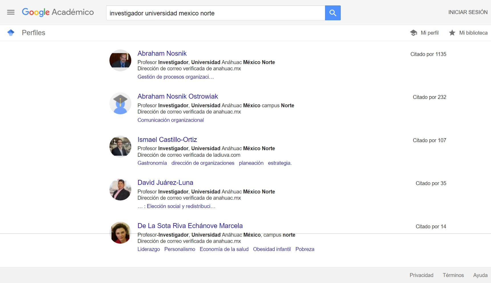
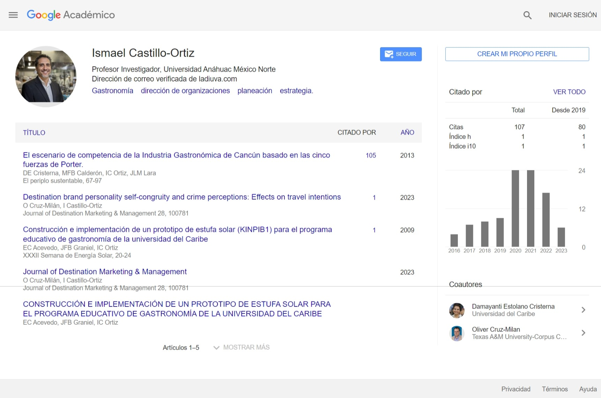

# Acerca de: Aplicación Java con Estructura Modelo Vista Controlador (MVC) y Conexión a SerpApi Google Scholar Profile y Autor

## Objetivo del Proyecto

El objetivo principal de este proyecto es desarrollar una aplicación Java que utilice la arquitectura Modelo Vista Controlador (MVC) para buscar y recopilar información detallada sobre investigadores reconocidos de universidades del norte de México. La conexión a las APIs de SerpApi, específicamente Google Scholar Profile y Autor, será fundamental para obtener datos precisos y enriquecidos sobre los investigadores.

## Características del Proyecto

### Tecnologías Utilizadas

- Java: JDK 21
- Gestión de Dependencias: Gradle 8.5

### Arquitectura MVC (Modelo Vista Controlador)

- **Model (Modelo):** Encargado de gestionar los datos y la lógica del negocio. Almacenará y estructurará la información recopilada de los investigadores.
  
- **View (Vista):** Responsable de la presentación de la información al usuario. Permitirá visualizar informes, estadísticas y resultados visuales de manera clara y organizada.
  
- **Controller (Controlador):** Actúa como intermediario entre el modelo y la vista. Gestionará las interacciones del usuario y las actualizaciones en el modelo, asegurando una comunicación eficiente.

## Funcionalidades Específicas

- **Conexión a SerpApi:** Implementación de peticiones GET a las APIs de SerpApi (Google Scholar Profile y Autor) para obtener datos detallados de investigadores.

- **Estructuración de Datos:** Modelado eficiente de la estructura de datos para almacenar y gestionar la información en el modelo de acuerdo con los resultados obtenidos de SerpApi.

- **Desarrollo bajo Patrón MVC:** Implementación y adherencia estricta al patrón Modelo Vista Controlador para garantizar una estructura de código organizada y modular.

- **Presentación de Resultados:** Utilización de la vista para presentar de manera clara y comprensible los resultados obtenidos por consola, ya sea a través de informes, mensajes, gráficos textuales u otros medios visuales en la interfaz de la consola.

- **Integración con SerpApi Google Scholar Profile y Autor**

- **Enriquecimiento de Datos:** Utilización de SerpApi para mejorar y complementar la información recopilada, garantizando datos precisos y actualizados.

- **Optimización de Resultados:** La conexión a SerpApi permite optimizar la calidad de los resultados, mejorando la presentación de informes visuales y ofreciendo una experiencia más completa al usuario.

## Contenido - Carpetas y Archivos

- **bin:** Carpeta que contiene los archivos compilados y ejecutables de la aplicación.
  - **app:** Almacena el archivo ejecutable App.class.
  - **controller:** Contiene el controlador ScholarInvestigatorController.class.
  - **model:** Guarda el modelo ScholarInvestigatorModel.class.
  - **utils:** Incluye clases de utilidades como ConfigExample.class, y SerpApiRequest.class.
  - **view:** Contiene la vista Author.class y ScholarInvestigatorView.class.

- **build:** Carpeta generada durante el proceso de construcción del proyecto.
  - **classes:** Contiene las clases compiladas.
  - **generated:** Carpeta que guarda recursos generados durante la construcción.
  - **libs:** Contiene el archivo JAR ejecutable busqueda-apiScholar-investigadores.jar.

- **gradle:** Carpeta relacionada con la configuración de Gradle.
  - **wrapper:** Contiene archivos esenciales para el funcionamiento del wrapper de Gradle.
  
- **gradle-8.5-bin:** Carpeta que contiene los archivos esenciales de Gradle versión 8.5.

- **src:** Carpeta principal que contiene el código fuente de la aplicación.
  - **main:** Carpeta principal de código fuente.
    - **java:** Contiene el código fuente en Java.
      - **app:** Contiene el archivo principal App.java.
      - **controller:** Contiene ScholarInvestigatorController.java.
      - **model:** Contiene ScholarInvestigatorModel.java.
      - **utils:** Contiene clases de utilidades como Config.java, ConfigExample.java, y SerpApiRequest.java.
      - **view:** Contiene las clases de vista Author.java y ScholarInvestigatorView.java.
    - **resources:** Contiene recursos adicionales.
      - **capturas:** Carpeta que guarda capturas de pantalla.

## Cambio de Clave Secreta

### Configuración de Clave Secreta en `ConfigExample.java`

En el archivo `ConfigExample.java` ubicado en la carpeta `utils`, se proporciona un ejemplo para configurar la clave secreta de SerpApi Google Scholar Profile y Author. Sigue estos pasos:

1. Abre el archivo `ConfigExample.java`.
2. Localiza la variable `API_KEY` y reemplaza `"YOUR_API_KEY_HERE"` con tu clave secreta proporcionada por SerpApi.

Recuerda que `ConfigExample.java` es un ejemplo, y la configuración real debe realizarse en el archivo `Config.java` para garantizar la seguridad de la clave secreta.


## Dependencias

```gradle

dependencies {
    implementation 'com.fasterxml.jackson.core:jackson-databind:2.13.0'
    implementation 'com.fasterxml.jackson.core:jackson-annotations:2.13.0'
    implementation 'com.fasterxml.jackson.core:jackson-core:2.13.0'
}

```

Estructura del proyecto

```plaintext
  

busqueda-apiScholar-investigadores
├── bin
│   └── main
│       ├── app
│       │   └── App.class
│       ├── controller
│       │   └── ScholarInvestigatorController.class
│       ├── model
│       │   └── ScholarInvestigatorModel.class
│       ├── utils
│       │   ├── Config.class
│       │   ├── ConfigExample.class
│       │   └── SerpApiRequest.class
│       └── view
│           ├── Author.class
│           └── ScholarInvestigatorView.class
├── build
│   ├── classes
│   │   └── java
│   │       └── main
│   │           ├── app
│   │           │   └── App.class
│   │           ├── controller
│   │           │   └── ScholarInvestigatorController.class
│   │           ├── model
│   │           │   └── ScholarInvestigatorModel.class
│   │           ├── utils
│   │           │   ├── Config.class
│   │           │   ├── ConfigExample.class
│   │           │   └── SerpApiRequest.class
│   │           └── view
│   │               ├── Author.class
│   │               └── ScholarInvestigatorView.class
│   ├── generated
│   │   └── sources
│   │       ├── annotationProcessor
│   │       │   └── java
│   │       └── headers
│   │           └── java
│   └── libs
│       └── busqueda-apiScholar-investigadores.jar
├── gradle
│   └── wrapper
│       ├── gradle-wrapper.jar
│       └── gradle-wrapper.properties
├── gradle-8.5-bin
│   └── gradle-8.5
│       ├── LICENSE
│       ├── NOTICE
│       ├── README
│       ├── bin
│       │   ├── gradle
│       │   └── gradle.bat
│       ├── init.d
│       │   └── readme.txt
│       └── lib
│           ├── HikariCP-4.0.3.jar
│           ├── ... (otros archivos de la biblioteca de Gradle)
├── src
│   └── main
│       ├── java
│       │   ├── app
│       │   │   └── App.java
│       │   ├── controller
│       │   │   └── ScholarInvestigatorController.java
│       │   ├── model
│       │   │   └── ScholarInvestigatorModel.java
│       │   ├── utils
│       │   │   ├── Config.java
│       │   │   ├── ConfigExample.java
│       │   │   └── SerpApiRequest.java
│       │   └── view
│       │       ├── Author.java
│       │       └── ScholarInvestigatorView.java
│       └── resources
│           └── capturas
│               ├── busquedas_totales
│               │   └── Captura_Busquedas_realizadas_completas
│               │       └── Captura web_12-1-2024_81937_serpapi.com.jpeg
│               ├── consola
│               │   ├── google_scholar_results_1.png
│               │   ├── google_scholar_results_2.png
│               │   ├── google_scholar_results_3.png
│               │   ├── google_scholar_results_4.png
│               │   └── google_scholar_results_5.png
│               ├── google_scholar_author
│               │   ├── Captura_GoogleScholarAuthor_investigador_universidad_norte_mexico
│               │   │   └── Captura web_12-1-2024_882_serpapi.com.jpeg
│               │   ├── Capturas_GoogleScholarAuthor_investigador_universidad_mexico_norte
│               │   │   ├── Captura web_12-1-2024_74726_serpapi.com.jpeg
│               │   │   ├── Captura web_12-1-2024_74830_serpapi.com.jpeg
│               │   │   ├── Captura web_12-1-2024_7483_serpapi.com.jpeg
│               │   │   ├── Captura web_12-1-2024_7533_serpapi.com.jpeg
│               │   │   └── Captura web_12-1-2024_882_serpapi.com.jpeg
│               │   └── Capturas_GoogleScholarAutor_investigador-universidad-mexico
│               │       ├── Captura web_11-1-2024_132335_serpapi.com.jpeg
│               │       ├── Captura web_11-1-2024_132931_serpapi.com.jpeg
│               │       ├── Captura web_11-1-2024_133044_serpapi.com.jpeg
│               │       ├── Captura web_11-1-2024_133150_serpapi.com.jpeg
│               │       ├── Captura web_11-1-2024_13400_serpapi.com.jpeg
│               │       ├── Captura web_11-1-2024_134058_serpapi.com.jpeg
│               │       ├── Captura web_11-1-2024_134138_serpapi.com.jpeg
│               │       ├── Captura web_11-1-2024_134247_serpapi.com.jpeg
│               │       ├── Captura web_11-1-2024_134334_serpapi.com.jpeg
│               │       └── Captura web_11-1-2024_134432_serpapi.com.jpeg
│               └── google_scholar_profile
│                   ├── Capturas_GoogleScholarProfile_investigador-universidad-mexico
│                   │   ├── Captura web_11-1-2024_131624_serpapi.com.jpeg
│                   │   ├── Captura web_11-1-2024_131712_scholar.google.com.jpeg
│                   │   ├── Captura web_11-1-2024_131740_scholar.google.com.jpeg
│                   │   ├── Captura web_11-1-2024_131813_scholar.google.com.jpeg
│                   │   ├── Captura web_11-1-2024_131847_scholar.google.com.jpeg
│                   │   ├── Captura web_11-1-2024_131925_scholar.google.com.jpeg
│                   │   ├── Captura web_11-1-2024_132045_scholar.google.com.jpeg
│                   │   └── Captura web_11-1-2024_13209_scholar.google.com.jpeg
│                   └── Capturas_GoogleScholarProfile_investigador_universidad_mexico_norte
│                       └── Captura web_12-1-2024_74630_serpapi.com.jpeg
├── .gitignore
├── LICENSE.md
└── README.md

  
```
## Archivo .gitignore

Este proyecto incluye un archivo `.gitignore` que está configurado para ignorar los archivos y directorios generados durante el desarrollo y construcción del proyecto. Asegúrate de revisar y no incluir en el repositorio archivos sensibles como claves de API o configuraciones específicas para tu entorno local.

Si necesitas agregar más reglas al `.gitignore`, puedes hacerlo según las necesidades específicas del desarrollo.

## Comandos Gradle
Para ejecutar la aplicación, utiliza el siguiente comando:

```bash

gradle run

```

Para construir el proyecto, puedes usar:

```bash

gradle build


```
## Licencia

Este proyecto está bajo la Licencia (Versión Limitada) - ver el archivo LICENSE.md para más detalles.

## Impacto Institucional

Este proyecto no solo contribuye al desarrollo de una herramienta eficiente para la recopilación de información académica, sino que también sienta las bases para futuras investigaciones y análisis en el ámbito institucional. La conexión a SerpApi asegura la obtención de datos confiables, mientras que la arquitectura MVC facilita la mantenibilidad y escalabilidad del sistema. En resumen, este proyecto marca un paso significativo hacia la optimización de procesos académicos y la mejora continua en la calidad de la información recopilada.

## Captura de Google Scholar Profile y Author






